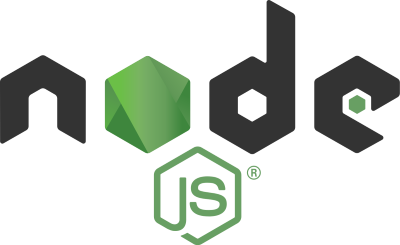

 | [Home](https://mervy.github.io/javascript-node.js) | [Exercises](https://mervy.github.io/javascript-node.js//pages/exercises) | [Projects](https://mervy.github.io/javascript-node.js/pages/projects)

# Projetos

Aqui estão algumas ideias de projetos que você pode considerar para aplicar seus conhecimentos em Node.js e criar aplicações práticas e úteis:

1. **Aplicativo de Lista de Tarefas:**
   Crie um aplicativo de lista de tarefas onde os usuários possam adicionar, marcar como concluídas e remover tarefas. Use Express.js para criar o servidor e armazene as tarefas em um banco de dados.

2. **Blog Pessoal:**
   Desenvolva um blog pessoal onde os usuários possam criar e editar postagens. Use Express.js para criar as rotas e armazene as postagens em um banco de dados. Implemente recursos como autenticação de usuário para permitir que os autores gerenciem suas próprias postagens.

3. **Chat em Tempo Real:**
   Crie um aplicativo de chat em tempo real usando WebSockets. Os usuários podem criar salas de chat e se comunicar em tempo real. Isso pode ser estendido para adicionar recursos como emojis, imagens e histórico de mensagens.

4. **API de Filmes/Séries:**
   Construa uma API que forneça informações sobre filmes e séries, como detalhes, avaliações e trailers. Use Node.js para criar o servidor e armazene os dados em um banco de dados.

5. **Gerenciador de Finanças Pessoais:**
   Desenvolva um aplicativo para ajudar os usuários a gerenciar suas finanças pessoais. Os usuários podem registrar despesas, categorizar transações e gerar relatórios. Use Express.js para criar o servidor e um banco de dados para armazenar os dados financeiros.

6. **Plataforma de E-Commerce Simples:**
   Crie uma plataforma de comércio eletrônico onde os usuários possam listar produtos, adicionar ao carrinho e fazer compras. Use Express.js para criar o backend e integre um sistema de pagamento para processar transações.

7. **Aplicativo de Previsão do Tempo:**
   Crie um aplicativo que forneça previsões do tempo com base na localização dos usuários. Use APIs de terceiros para obter dados meteorológicos e Node.js para criar o servidor.

8. **Rede Social de Música:**
   Desenvolva uma rede social onde os usuários possam compartilhar suas músicas favoritas, criar playlists e seguir outros usuários. Use Node.js para gerenciar as interações entre os usuários e para armazenar informações sobre as músicas.

9. **Gerenciador de Notas:**
   Crie um aplicativo para fazer anotações e organizá-las por categorias. Use Node.js para criar o backend e um banco de dados para armazenar as notas dos usuários.

10. **API de Cotações de Ações:**
    Construa uma API que forneça informações atualizadas sobre cotações de ações. Use Node.js para criar o servidor e integre-se a uma API de terceiros que ofereça dados de mercado.

Lembre-se de que o objetivo dos projetos é aplicar e consolidar seus conhecimentos, então não tenha medo de ser criativo e experimentar novas ideias. À medida que você trabalha nesses projetos, você ganhará confiança e habilidades valiosas que o ajudarão a se tornar um desenvolvedor mais competente em Node.js.

## 01. Quiz
Monte um quiz com opção de inserir as perguntas e as 5 repostas bem como definir qual resposta é a correta;
O quiz deve contar quantas questões estão no banco de dados mysql e mostrar a quantidade de acertos e porcentagem
ao final do quiz. 
Também deve ter uma tela de login ou cadastro para a pessoa responder ao quiz. Deve ser usado javascript puro, node.js,
mysql, etc

Claro! Vou lhe fornecer um guia passo a passo para criar um quiz com as funcionalidades que você descreveu usando JavaScript puro, Node.js e MySQL. Vamos dividir o processo em etapas:

**Passo 1: Configuração do Ambiente:**

1. Certifique-se de ter o Node.js e o MySQL instalados em seu sistema.
2. Crie um diretório para o projeto e execute `npm init -y` para inicializar o projeto.

**Passo 2: Banco de Dados MySQL:**

1. Crie um banco de dados no MySQL para armazenar as perguntas e respostas do quiz.
2. Crie uma tabela `questions` com os campos: `id`, `question`, `answer1`, `answer2`, `answer3`, `answer4`, `answer5` e `correctAnswer`.

**Passo 3: Estrutura do Projeto:**

Organize seu projeto da seguinte maneira:

```
quiz-app/
|-- public/
|   |-- index.html
|   |-- styles.css
|-- src/
|   |-- server.js
|-- package.json
```

**Passo 4: Configuração do Servidor:**

1. No arquivo `server.js`, configure o servidor usando Node.js e Express.js.
2. Configure a conexão com o banco de dados MySQL usando a biblioteca `mysql2`.

**Passo 5: Tela de Login/Cadastro:**

1. Crie uma página `index.html` na pasta `public` para a tela de login/cadastro.
2. Use HTML e JavaScript para criar o formulário de login/cadastro e manipular os eventos.

**Passo 6: Tela do Quiz:**

1. Crie outra página `quiz.html` na pasta `public` para exibir o quiz após o login.
2. Use JavaScript para buscar as perguntas do banco de dados e exibi-las na página.

**Passo 7: Lógica do Quiz:**

1. No arquivo `server.js`, crie rotas para buscar as perguntas do banco de dados e verificar as respostas do usuário.
2. Use JavaScript para manipular as respostas do usuário e calcular a pontuação.

**Passo 8: Resultados do Quiz:**

1. Exiba os resultados do quiz ao final, mostrando a quantidade de acertos e a porcentagem de acertos.
2. Use JavaScript para calcular a pontuação e exibir os resultados.

Lembre-se de que esse é um guia de alto nível para criar um quiz com as funcionalidades que você descreveu. Cada etapa envolve várias tarefas específicas que você precisará implementar. À medida que você avança no projeto, consulte a documentação do Node.js, Express.js, MySQL e outras bibliotecas relevantes para obter mais informações sobre como implementar cada parte.

Este projeto pode ser uma excelente maneira de aplicar seus conhecimentos em JavaScript, Node.js e MySQL, além de aprimorar suas habilidades de desenvolvimento web. Boa sorte e divirta-se construindo o seu quiz!

Vou fornecer a estrutura básica do projeto e os principais trechos de código para cada parte do projeto, conforme os passos que descrevi anteriormente.

**Passo 1: Configuração do Ambiente:**

Certifique-se de ter o Node.js e o MySQL instalados em seu sistema.

**Passo 2: Banco de Dados MySQL:**

Crie um banco de dados no MySQL chamado `quizdb`. Em seguida, crie a tabela `questions`:

```sql
CREATE DATABASE quizdb;

USE quizdb;

CREATE TABLE questions (
  id INT AUTO_INCREMENT PRIMARY KEY,
  question TEXT,
  answer1 TEXT,
  answer2 TEXT,
  answer3 TEXT,
  answer4 TEXT,
  answer5 TEXT,
  correctAnswer INT
);
```

**Passo 3: Estrutura do Projeto:**

```
quiz-app/
|-- public/
|   |-- index.html
|   |-- quiz.html
|-- src/
|   |-- server.js
|-- package.json
```

**Passo 4: Configuração do Servidor:**

Instale as dependências:

```bash
npm install express mysql2
```

**`src/server.js`**
```javascript
const express = require('express');
const mysql = require('mysql2');

const app = express();
const PORT = process.env.PORT || 3000;

const db = mysql.createConnection({
  host: 'localhost',
  : 'root',
  password: 'senha',
  database: 'quizdb'
});

app.use(express.json());

app.listen(PORT, () => {
  console.log(`Servidor rodando na porta ${PORT}`);
});
```

**Passo 5: Tela de Login/Cadastro:**

**`public/index.html`**
```html
<!DOCTYPE html>
<html lang="en">
<head>
  <meta charset="UTF-8">
  <title>Quiz App</title>
</head>
<body>
  <h1>Quiz App</h1>
  <form id="loginForm">
    <input type="text" placeholder="Nome de usuário" id="name">
    <button type="submit">Login</button>
  </form>
</body>
</html>
```

**Passo 6: Tela do Quiz:**

**`public/quiz.html`**
```html
<!DOCTYPE html>
<html lang="en">
<head>
  <meta charset="UTF-8">
  <title>Quiz</title>
</head>
<body>
  <h1>Quiz</h1>
  <div id="question"></div>
  <form id="quizForm">
    <label><input type="radio" name="answer" value="1"> Resposta 1</label><br>
    <label><input type="radio" name="answer" value="2"> Resposta 2</label><br>
    <label><input type="radio" name="answer" value="3"> Resposta 3</label><br>
    <label><input type="radio" name="answer" value="4"> Resposta 4</label><br>
    <label><input type="radio" name="answer" value="5"> Resposta 5</label><br>
    <button type="submit">Próxima Pergunta</button>
  </form>
  <div id="result"></div>
</body>
</html>
```

**Passo 7: Lógica do Quiz:**

**`src/server.js`**
```javascript
// ...

app.get('/questions', (req, res) => {
  db.query('SELECT * FROM questions', (err, rows) => {
    if (err) {
      res.status(500).json({ error: 'Erro ao buscar perguntas.' });
    } else {
      res.json(rows);
    }
  });
});

app.post('/check-answer', (req, res) => {
  const { questionId, Answer } = req.body;

  db.query('SELECT correctAnswer FROM questions WHERE id = ?', [questionId], (err, rows) => {
    if (err) {
      res.status(500).json({ error: 'Erro ao buscar resposta correta.' });
    } else {
      const correctAnswer = rows[0].correctAnswer;
      const isCorrect = correctAnswer === Answer;

      res.json({ isCorrect });
    }
  });
});

// ...
```

**Passo 8: Resultados do Quiz:**

**`public/quiz.html`**
```html
<!-- ... -->
<div id="result">
  <p id="score"></p>
  <p id="percentage"></p>
</div>
<!-- ... -->
```

**`src/server.js`**
```javascript
// ...

app.get('/results', (req, res) => {
  const { Id } = req.query;

  db.query('SELECT COUNT(*) AS total FROM questions', (err, totalRows) => {
    if (err) {
      res.status(500).json({ error: 'Erro ao calcular quantidade total de perguntas.' });
    } else {
      db.query('SELECT COUNT(*) AS correct FROM _answers WHERE _id = ? AND is_correct = true', [Id], (err, correctRows) => {
        if (err) {
          res.status(500).json({ error: 'Erro ao calcular quantidade de respostas corretas.' });
        } else {
          const total = totalRows[0].total;
          const correct = correctRows[0].correct;
          const percentage = (correct / total) * 100;

          res.json({ total, correct, percentage });
        }
      });
    }
  });
});

// ...
```

Lembre-se de ajustar as configurações do banco de dados (como usuário e senha) conforme necessário. Além disso, este é apenas um exemplo simplificado para ilustrar o processo. Você precisará adicionar mais lógica e tratamento de erros para criar um aplicativo mais robusto e seguro.

## 02. Landing page

Uma landing page, é uma página que tem como objetivo vender um produto ou captar um cadastro, é o tipo de trabalho mais comum para iniciantes e uma ótima oportunidade para praticar seus conhecimentos de HTML e CSS, mas aqui usar javascript puro e node.js se necessário

Com certeza, criar uma landing page é um ótimo exercício para aplicar seus conhecimentos em HTML, CSS e até mesmo JavaScript puro e Node.js. Vou lhe mostrar como criar uma landing page simples, com formulário de cadastro, usando essas tecnologias.

**Passo 1: Estrutura de Diretórios:**

Organize seu projeto da seguinte forma:

```
landing-page/
|-- public/
|   |-- index.html
|   |-- styles.css
|-- src/
|   |-- server.js
|-- package.json
```

**Passo 2: Criando a Página HTML:**

Crie a estrutura básica do HTML para sua landing page.

**`public/index.html`**
```html
<!DOCTYPE html>
<html lang="en">
<head>
  <meta charset="UTF-8">
  <meta name="viewport" content="width=device-width, initial-scale=1.0">
  <link rel="stylesheet" href="styles.css">
  <title>Landing Page</title>
</head>
<body>
  <header>
    <h1>Minha Landing Page</h1>
    <p>Uma descrição incrível do produto ou serviço.</p>
  </header>

  <section class="cta">
    <h2>Receba nossas ofertas exclusivas</h2>
    <form id="signupForm">
      <input type="email" placeholder="Seu e-mail" required>
      <button type="submit">Cadastrar</button>
    </form>
  </section>

  <footer>
    <p>&copy; 2023 Minha Empresa</p>
  </footer>

  <script src="scripts.js"></script>
</body>
</html>
```

**Passo 3: Estilizando com CSS:**

Estilize a página com CSS para torná-la atraente.

**`public/styles.css`**
```css
/* Estilos gerais */
body {
  font-family: Arial, sans-serif;
  margin: 0;
  padding: 0;
}

/* Estilos do cabeçalho */
header {
  background-color: #f7f7f7;
  text-align: center;
  padding: 2rem 0;
}

/* Estilos da seção de chamada para ação (CTA) */
.cta {
  background-color: #2d3e50;
  color: #fff;
  text-align: center;
  padding: 4rem 0;
}

/* Estilos do rodapé */
footer {
  background-color: #f7f7f7;
  text-align: center;
  padding: 1rem 0;
}

/* Estilos do formulário */
form {
  display: flex;
  justify-content: center;
  align-items: center;
  margin-top: 1rem;
}

input[type="email"] {
  padding: 0.5rem;
  border: none;
  border-radius: 4px;
  margin-right: 0.5rem;
}

button[type="submit"] {
  background-color: #e74c3c;
  color: #fff;
  border: none;
  border-radius: 4px;
  padding: 0.5rem 1rem;
  cursor: pointer;
}

button[type="submit"]:hover {
  background-color: #c0392b;
}
```

**Passo 4: Trabalhando com o Servidor Node.js:**

Vamos usar o Node.js para lidar com o cadastro dos e-mails.

**`src/server.js`**
```javascript
const express = require('express');
const app = express();
const PORT = process.env.PORT || 3000;

app.use(express.static('public'));
app.use(express.urlencoded({ extended: true }));

app.post('/signup', (req, res) => {
  const { email } = req.body;
  // Aqui, você pode adicionar lógica para salvar o e-mail em um banco de dados ou enviar para um serviço de e-mail marketing.
  console.log(`Novo cadastro: ${email}`);
  res.redirect('/');
});

app.listen(PORT, () => {
  console.log(`Servidor rodando na porta ${PORT}`);
});
```

**Passo 5: Adicionando JavaScript para o Formulário:**

Vamos usar JavaScript para lidar com o envio do formulário.

**`public/scripts.js`**
```javascript
const signupForm = document.getElementById('signupForm');

signupForm.addEventListener('submit', (e) => {
  e.preventDefault();

  const emailInput = document.querySelector('input[type="email"]');
  const email = emailInput.value;

  fetch('/signup', {
    method: 'POST',
    headers: {
      'Content-Type': 'application/x-www-form-urlencoded'
    },
    body: `email=${encodeURIComponent(email)}`
  })
  .then(() => {
    alert('Cadastro realizado com sucesso!');
    emailInput.value = '';
  })
  .catch((error) => {
    console.error('Erro ao cadastrar:', error);
  });
});
```

Lembre-se de adaptar o código acima às suas necessidades e adicionar recursos como validações, armazenamento de e-mails em um banco de dados ou integração com serviços de e-mail marketing.

Com esses passos, você criou uma landing page simples usando HTML, CSS, JavaScript puro e Node.js. Essa é apenas uma abordagem inicial e você pode aprimorar e expandir a página conforme sua criatividade e necessidades específicas.

## 03. App de clima

Desenvolva um App de clima não muito complexo, o importante é fornecer informações meteorológicas conforme a localização do usuário. O usuário informará a cidade e será dado o clima/temperatura do dia. Usar as tecnologias citadas

Claro! Vou mostrar como criar um aplicativo de clima simples que permite aos usuários obter informações meteorológicas com base na cidade que eles fornecem. Vamos usar HTML, CSS, JavaScript puro e Node.js, juntamente com a API de previsão do tempo do OpenWeatherMap.

**Passo 1: Estrutura de Diretórios:**

Organize seu projeto da seguinte forma:

```
weather-app/
|-- public/
|   |-- index.html
|   |-- styles.css
|-- src/
|   |-- server.js
|-- package.json
```

**Passo 2: Criando a Página HTML:**

Crie a estrutura básica do HTML para o aplicativo.

**`public/index.html`**
```html
<!DOCTYPE html>
<html lang="en">
<head>
  <meta charset="UTF-8">
  <meta name="viewport" content="width=device-width, initial-scale=1.0">
  <link rel="stylesheet" href="styles.css">
  <title>Weather App</title>
</head>
<body>
  <header>
    <h1>Weather App</h1>
  </header>

  <main>
    <form id="cityForm">
      <label for="city">Informe a cidade:</label>
      <input type="text" id="city" required>
      <button type="submit">Obter Clima</button>
    </form>
    <div id="weatherInfo"></div>
  </main>

  <footer>
    <p>&copy; 2023 Weather App</p>
  </footer>

  <script src="scripts.js"></script>
</body>
</html>
```

**Passo 3: Estilizando com CSS:**

Estilize a página com CSS para torná-la atraente.

**`public/styles.css`**
```css
/* Estilos gerais */
body {
  font-family: Arial, sans-serif;
  margin: 0;
  padding: 0;
}

/* Estilos do cabeçalho */
header {
  background-color: #3498db;
  color: #fff;
  text-align: center;
  padding: 2rem 0;
}

/* Estilos do formulário */
form {
  text-align: center;
  margin: 2rem 0;
}

input[type="text"] {
  padding: 0.5rem;
  border: none;
  border-radius: 4px;
  margin-right: 0.5rem;
}

button[type="submit"] {
  background-color: #27ae60;
  color: #fff;
  border: none;
  border-radius: 4px;
  padding: 0.5rem 1rem;
  cursor: pointer;
}

button[type="submit"]:hover {
  background-color: #219651;
}

/* Estilos das informações climáticas */
#weatherInfo {
  text-align: center;
  margin-top: 2rem;
}
```

**Passo 4: Trabalhando com o Servidor Node.js:**

Vamos usar o Node.js para fazer chamadas à API do OpenWeatherMap.

**`src/server.js`**
```javascript
const express = require('express');
const fetch = require('node-fetch');
const app = express();
const PORT = process.env.PORT || 3000;

app.use(express.static('public'));
app.use(express.urlencoded({ extended: true }));

const API_KEY = 'SUA_CHAVE_DE_API';

app.get('/weather/:city', async (req, res) => {
  const city = req.params.city;
  const apiUrl = `https://api.openweathermap.org/data/2.5/weather?q=${city}&appid=${API_KEY}&units=metric`;

  try {
    const response = await fetch(apiUrl);
    const data = await response.json();

    if (response.ok) {
      res.json(data);
    } else {
      res.status(data.cod).json({ message: data.message });
    }
  } catch (error) {
    res.status(500).json({ error: 'Erro ao obter informações meteorológicas.' });
  }
});

app.listen(PORT, () => {
  console.log(`Servidor rodando na porta ${PORT}`);
});
```

**Passo 5: Adicionando JavaScript para a Interação com a API:**

Vamos usar JavaScript para fazer chamadas à API do nosso servidor Node.js.

**`public/scripts.js`**
```javascript
const cityForm = document.getElementById('cityForm');
const weatherInfo = document.getElementById('weatherInfo');

cityForm.addEventListener('submit', async (e) => {
  e.preventDefault();

  const cityInput = document.getElementById('city');
  const cityName = cityInput.value;

  try {
    const response = await fetch(`/weather/${cityName}`);
    const data = await response.json();

    if (response.ok) {
      const temperature = data.main.temp;
      const description = data.weather[0].description;
      weatherInfo.innerHTML = `<p>Temperatura em ${cityName}: ${temperature}°C, ${description}</p>`;
    } else {
      weatherInfo.innerHTML = `<p>${data.message}</p>`;
    }
  } catch (error) {
    console.error('Erro ao obter informações climáticas:', error);
    weatherInfo.innerHTML = '<p>Erro ao obter informações climáticas.</p>';
  }
});
```

Lembre-se de substituir `'SUA_CHAVE_DE_API'` pela chave de API fornecida pelo OpenWeatherMap. Além disso, ajuste o código conforme necessário para atender às suas necessidades específicas.

Com esses passos, você criou um aplicativo de clima simples que permite aos usuários obter informações meteorológicas com base na cidade que eles fornecem. Esse é apenas um exemplo inicial, e você pode aprimorar e expandir o aplicativo com recursos adicionais, como exibição de ícones de clima, previsões futuras e muito mais.


## 04. Aplicativo de receitas

Desenvolva um aplicativo com várias receitas, ideal para o nicho de emagrecimento e saúde. Esse aplicativo deve usar Consumo de API
Criação de display de categorias de uma lista Navegação entre telas do aplicativo/site. Usar as tecnologias já citadas

Vamos criar um aplicativo de receitas saudáveis que utiliza uma API de receitas para buscar e exibir informações sobre diferentes pratos. Usaremos HTML, CSS, JavaScript puro e Node.js para configurar um servidor e consumir a API.

**Passo 1: Estrutura de Diretórios:**

Organize seu projeto da seguinte forma:

```
healthy-recipes-app/
|-- public/
|   |-- index.html
|   |-- styles.css
|-- src/
|   |-- server.js
|-- package.json
```

**Passo 2: Criando a Página HTML:**

Crie a estrutura básica do HTML para o aplicativo.

**`public/index.html`**
```html
<!DOCTYPE html>
<html lang="en">
<head>
  <meta charset="UTF-8">
  <meta name="viewport" content="width=device-width, initial-scale=1.0">
  <link rel="stylesheet" href="styles.css">
  <title>Healthy Recipes App</title>
</head>
<body>
  <header>
    <h1>Healthy Recipes</h1>
  </header>

  <main>
    <div id="categories"></div>
    <div id="recipes"></div>
  </main>

  <footer>
    <p>&copy; 2023 Healthy Recipes App</p>
  </footer>

  <script src="scripts.js"></script>
</body>
</html>
```

**Passo 3: Estilizando com CSS:**

Estilize a página com CSS para torná-la atraente.

**`public/styles.css`**
```css
/* Estilos gerais */
body {
  font-family: Arial, sans-serif;
  margin: 0;
  padding: 0;
}

/* Estilos do cabeçalho */
header {
  background-color: #3498db;
  color: #fff;
  text-align: center;
  padding: 2rem 0;
}

/* Estilos do rodapé */
footer {
  background-color: #f7f7f7;
  text-align: center;
  padding: 1rem 0;
}

/* Estilos das categorias */
#categories {
  text-align: center;
  margin: 2rem 0;
}

/* Estilos das receitas */
#recipes {
  display: flex;
  flex-wrap: wrap;
  justify-content: space-around;
  padding: 2rem;
}

.recipe {
  width: calc(33.33% - 2rem);
  margin: 1rem;
  padding: 1rem;
  background-color: #f7f7f7;
  border-radius: 4px;
  box-shadow: 0 2px 4px rgba(0, 0, 0, 0.1);
}

.recipe img {
  max-width: 100%;
  height: auto;
}

.recipe h3 {
  margin-top: 0.5rem;
  font-size: 1.2rem;
}
```

**Passo 4: Trabalhando com o Servidor Node.js:**

Vamos usar o Node.js para configurar um servidor e consumir a API de receitas.

Instale as dependências:

```bash
npm install express node-fetch
```

**`src/server.js`**
```javascript
const express = require('express');
const fetch = require('node-fetch');
const app = express();
const PORT = process.env.PORT || 3000;

app.use(express.static('public'));

const API_KEY = 'SUA_CHAVE_DE_API';
const API_URL = `https://api.spoonacular.com/recipes/complexSearch?apiKey=${API_KEY}&number=12&addRecipeInformation=true&instructionsRequired=true&sort=random`;

app.get('/recipes', async (req, res) => {
  try {
    const response = await fetch(API_URL);
    const data = await response.json();
    res.json(data.results);
  } catch (error) {
    res.status(500).json({ error: 'Erro ao obter receitas.' });
  }
});

app.listen(PORT, () => {
  console.log(`Servidor rodando na porta ${PORT}`);
});
```

**Passo 5: Adicionando JavaScript para Consumir a API:**

**`public/scripts.js`**
```javascript
const categoriesContainer = document.getElementById('categories');
const recipesContainer = document.getElementById('recipes');

// Função para exibir receitas
function displayRecipes(recipes) {
  recipesContainer.innerHTML = '';

  recipes.forEach((recipe) => {
    const recipeElement = document.createElement('div');
    recipeElement.className = 'recipe';

    recipeElement.innerHTML = `
      
      <h3>${recipe.title}</h3>
      <p>${recipe.summary}</p>
    `;

    recipesContainer.appendChild(recipeElement);
  });
}

// Função para buscar receitas na API
async function fetchRecipes() {
  try {
    const response = await fetch('/recipes');
    const recipes = await response.json();
    displayRecipes(recipes);
  } catch (error) {
    console.error('Erro ao buscar receitas:', error);
  }
}

// Carregar receitas ao carregar a página
fetchRecipes();
```

Com esses passos, você criou um aplicativo de receitas saudáveis que exibe diferentes pratos com informações relevantes. Essa é uma base inicial que pode ser expandida adicionando funcionalidades como filtragem por categoria, exibição detalhada das receitas e muito mais. Certifique-se de substituir `'SUA_CHAVE_DE_API'` pela chave de API fornecida pela API de receitas que você escolher utilizar.

## 05. Blog

Site basico tipo blog com posts de notícias com categorias, texto, imagem, autor, data de cadastro, etc com opção de listagem de categorias ou todos os posts, com paginação dos resultados nas paginas. Usar html, css, js, node.js e mysql. Criar a parte admin para CRUD das noticias, autores, etc

Claro! Vou guiar você na criação de um site básico tipo blog com posts de notícias, categorias, autor, data de cadastro e uma área de administração para CRUD (Criar, Ler, Atualizar, Deletar) das notícias, autores, etc. Vamos usar HTML, CSS, JavaScript puro, Node.js e MySQL. 

**Passo 1: Estrutura de Diretórios:**

Organize seu projeto da seguinte forma:

```
basic-blog-site/
|-- public/
|   |-- index.html
|   |-- styles.css
|   |-- admin.html
|   |-- admin-styles.css
|-- src/
|   |-- server.js
|   |-- db.js
|   |-- routes.js
|-- views/
|   |-- layout.ejs
|   |-- admin-layout.ejs
|   |-- home.ejs
|   |-- admin.ejs
|-- package.json
```

**Passo 2: Configurando o Banco de Dados MySQL:**

Instale o pacote `mysql2`:

```bash
npm install mysql2
```

Configure a conexão com o banco de dados em `src/db.js`:

```javascript
const mysql = require('mysql2');

const db = mysql.createConnection({
  host: 'localhost',
  : 'seu_usuario',
  password: 'sua_senha',
  database: 'basic_blog_db'
});

module.exports = db;
```

Crie o banco de dados `basic_blog_db` e as tabelas `posts`, `categories` e `authors` no MySQL.

**Passo 3: Criando as Rotas com Express:**

Instale os pacotes `express`, `body-parser`, `ejs` e `express-session`:

```bash
npm install express body-parser ejs express-session
```

Configure as rotas em `src/routes.js`:

```javascript
const express = require('express');
const router = express.Router();
const db = require('./db');

// Página inicial
router.get('/', async (req, res) => {
  // Obtenha os posts do banco de dados
  const posts = await db.promise().query('SELECT * FROM posts ORDER BY created_at DESC');
  res.render('home', { posts: posts[0] });
});

module.exports = router;
```

**Passo 4: Criando as Páginas EJS:**

Crie os arquivos de layout `layout.ejs` e `admin-layout.ejs` em `views/`:

**`views/layout.ejs`**
```html
<!DOCTYPE html>
<html lang="en">
<head>
  <meta charset="UTF-8">
  <meta name="viewport" content="width=device-width, initial-scale=1.0">
  <link rel="stylesheet" href="/styles.css">
  <title>Basic Blog</title>
</head>
<body>
  <header>
    <h1>Basic Blog</h1>
    <nav>
      <ul>
        <li><a href="/">Home</a></li>
      </ul>
    </nav>
  </header>

  <main>
    <%- body %>
  </main>

  <footer>
    <p>&copy; 2023 Basic Blog</p>
  </footer>
</body>
</html>
```

**`views/admin-layout.ejs`**
```html
<!-- Mesmo conteúdo que layout.ejs, mas pode adicionar links para páginas de administração aqui -->
```

Crie os arquivos de visualização `home.ejs` e `admin.ejs` em `views/`:

**`views/home.ejs`**
```html
<% layout('layout') %>
<% for (const post of posts) { %>
  <article>
    <h2><a href="#"><%= post.title %></a></h2>
    <p><%= post.content %></p>
    <p>Category: <%= post.category %></p>
    <p>Author: <%= post.author %></p>
    <p>Date: <%= post.created_at %></p>
  </article>
<% } %>
```

**`views/admin.ejs`**
```html
<!-- Formulários e listagem de notícias, autores, etc. -->
```

**Passo 5: Configurando o Express:**

Configure o servidor Express em `src/server.js`:

```javascript
const express = require('express');
const bodyParser = require('body-parser');
const session = require('express-session');
const app = express();
const PORT = process.env.PORT || 3000;

app.use(bodyParser.urlencoded({ extended: true }));
app.use(session({ secret: 'seu_secreto', resave: false, saveUninitialized: true }));
app.set('view engine', 'ejs');
app.set('views', 'views');

const routes = require('./routes');
app.use('/', routes);

app.listen(PORT, () => {
  console.log(`Servidor rodando na porta ${PORT}`);
});
```

**Passo 6: Estilizando as Páginas:**

Estilize as páginas em `public/styles.css` e `public/admin-styles.css` de acordo com suas preferências.

**Passo 7: Criando a Área de Administração:**

Crie a página de administração em `public/admin.html` e estilize-a com `public/admin-styles.css`.

**Passo 8: CRUD e Manipulação do Banco de Dados:**

Crie as rotas necessárias para o CRUD e manipulação do banco de dados em `src/routes.js` e `src/db.js`.

Lembre-se de que este é um guia básico e que você pode expandir e personalizar o site de acordo com suas necessidades e conhecimentos. Adicione autenticação de usuário para a área de administração, melhore o design, adicione recursos de edição e exclusão de notícias, etc.

Certifique-se de substituir os placeholders (como `seu_usuario`, `sua_senha` e `SUA_CHAVE_DE_API`) pelos valores reais. E também, implemente práticas seguras, como validação de entrada, sanitização de dados e proteção contra SQL injection.

Este é um projeto amplo e detalhado, então fique à vontade para fazer ajustes e melhorias conforme suas habilidades e objetivos.

Vou continuar a partir do ponto onde paramos e mostrar a você como criar a página de administração, estilizar com CSS e adicionar as rotas necessárias para o CRUD e manipulação do banco de dados.

**Passo 7: Criando a Página de Administração e Estilizando com CSS:**

Crie a página de administração em `public/admin.html`:

**`public/admin.html`**
```html
<!DOCTYPE html>
<html lang="en">
<head>
  <meta charset="UTF-8">
  <meta name="viewport" content="width=device-width, initial-scale=1.0">
  <link rel="stylesheet" href="admin-styles.css">
  <title>Administração - Basic Blog</title>
</head>
<body>
  <header>
    <h1>Administração - Basic Blog</h1>
  </header>

  <main>
    <!-- Formulários e listagem de notícias, autores, etc. -->
  </main>

  <footer>
    <p>&copy; 2023 Basic Blog</p>
  </footer>
</body>
</html>
```

Estilize a página de administração em `public/admin-styles.css`:

**`public/admin-styles.css`**
```css
/* Estilos gerais */
body {
  font-family: Arial, sans-serif;
  margin: 0;
  padding: 0;
}

/* Estilos do cabeçalho */
header {
  background-color: #3498db;
  color: #fff;
  text-align: center;
  padding: 2rem 0;
}

/* Estilos do rodapé */
footer {
  background-color: #f7f7f7;
  text-align: center;
  padding: 1rem 0;
}

/* Estilos dos formulários */
form {
  margin: 2rem auto;
  max-width: 500px;
  padding: 1rem;
  border: 1px solid #ccc;
  border-radius: 4px;
  box-shadow: 0 2px 4px rgba(0, 0, 0, 0.1);
}

form label {
  display: block;
  margin-bottom: 0.5rem;
}

form input[type="text"],
form textarea {
  width: 100%;
  padding: 0.5rem;
  border: 1px solid #ccc;
  border-radius: 4px;
  margin-bottom: 1rem;
}

form button[type="submit"] {
  background-color: #27ae60;
  color: #fff;
  border: none;
  border-radius: 4px;
  padding: 0.5rem 1rem;
  cursor: pointer;
}

form button[type="submit"]:hover {
  background-color: #219651;
}
```

**Passo 8: Criando as Rotas e Manipulando o Banco de Dados:**

Vamos criar as rotas necessárias para o CRUD e manipulação do banco de dados em `src/routes.js`:

**`src/routes.js`**
```javascript
const express = require('express');
const router = express.Router();
const db = require('./db');

// ...

// Rota para exibir a página de administração
router.get('/admin', (req, res) => {
  res.sendFile(__dirname + '/public/admin.html');
});

// Rota para adicionar um novo post
router.post('/admin/add-post', async (req, res) => {
  const { title, content, category, author } = req.body;
  const query = 'INSERT INTO posts (title, content, category, author) VALUES (?, ?, ?, ?)';
  
  try {
    const result = await db.promise().execute(query, [title, content, category, author]);
    console.log('Novo post adicionado:', result);
    res.redirect('/admin');
  } catch (error) {
    console.error('Erro ao adicionar novo post:', error);
    res.redirect('/admin');
  }
});

// Rota para listar todos os posts
router.get('/admin/posts', async (req, res) => {
  try {
    const query = 'SELECT * FROM posts ORDER BY created_at DESC';
    const posts = await db.promise().query(query);
    res.json(posts[0]);
  } catch (error) {
    console.error('Erro ao obter lista de posts:', error);
    res.status(500).json({ error: 'Erro ao obter lista de posts.' });
  }
});

// ... (Outras rotas para edição, exclusão, etc.)

module.exports = router;
```

**Passo 9: Atualizando o Servidor Express:**

Vamos atualizar o servidor Express em `src/server.js` para usar as rotas:

```javascript
const express = require('express');
const bodyParser = require('body-parser');
const session = require('express-session');
const app = express();
const PORT = process.env.PORT || 3000;

app.use(bodyParser.urlencoded({ extended: true }));
app.use(session({ secret: 'seu_secreto', resave: false, saveUninitialized: true }));
app.set('view engine', 'ejs');
app.set('views', 'views');

const routes = require('./routes');
app.use('/', routes);

app.listen(PORT, () => {
  console.log(`Servidor rodando na porta ${PORT}`);
});
```

Este é um projeto de exemplo básico que inclui a criação da página de administração, estilização com CSS e a configuração das rotas necessárias para o CRUD e manipulação do banco de dados. Lembre-se de substituir os placeholders (como `seu_usuario`, `sua_senha` e outros) pelos valores reais. Também considere adicionar autenticação de usuário, validação de entrada e outras medidas de segurança, dependendo das suas necessidades.

## 06. Aplicativo de Lista de Tarefas

Crie um aplicativo de lista de tarefas onde os usuários possam adicionar, marcar como concluídas e remover tarefas. Use Express.js para criar o servidor e armazene as tarefas em um banco de dados.

Claro! Vou guiar você na criação de um aplicativo de lista de tarefas simples usando Express.js como servidor e um banco de dados para armazenar as tarefas. Vamos usar Node.js, Express.js, MySQL como banco de dados e HTML/CSS/JavaScript para o front-end.

**Passo 1: Estrutura de Diretórios:**

Organize seu projeto da seguinte forma:

```
todo-app/
|-- public/
|   |-- index.html
|   |-- styles.css
|-- src/
|   |-- server.js
|   |-- db.js
|   |-- routes.js
|-- views/
|   |-- layout.ejs
|   |-- todo-list.ejs
|-- package.json
```

**Passo 2: Configurando o Banco de Dados MySQL:**

Instale o pacote `mysql2`:

```bash
npm install mysql2
```

Configure a conexão com o banco de dados em `src/db.js`:

```javascript
const mysql = require('mysql2');

const db = mysql.createConnection({
  host: 'localhost',
  : 'seu_usuario',
  password: 'sua_senha',
  database: 'todo_app_db'
});

module.exports = db;
```

Crie o banco de dados `todo_app_db` e a tabela `tasks` no MySQL:

```sql
CREATE DATABASE todo_app_db;

USE todo_app_db;

CREATE TABLE tasks (
  id INT AUTO_INCREMENT PRIMARY KEY,
  description TEXT NOT NULL,
  completed BOOLEAN DEFAULT false
);
```

**Passo 3: Criando as Rotas com Express:**

Instale os pacotes `express`, `body-parser`, `ejs`:

```bash
npm install express body-parser ejs
```

Configure as rotas em `src/routes.js`:

```javascript
const express = require('express');
const router = express.Router();
const db = require('./db');

// Página inicial
router.get('/', async (req, res) => {
  const tasks = await db.promise().query('SELECT * FROM tasks');
  res.render('todo-list', { tasks: tasks[0] });
});

// Adicionar tarefa
router.post('/add-task', async (req, res) => {
  const description = req.body.description;
  await db.promise().execute('INSERT INTO tasks (description) VALUES (?)', [description]);
  res.redirect('/');
});

// Marcar tarefa como concluída
router.post('/complete-task/:id', async (req, res) => {
  const taskId = req.params.id;
  await db.promise().execute('UPDATE tasks SET completed = true WHERE id = ?', [taskId]);
  res.redirect('/');
});

// Remover tarefa
router.post('/delete-task/:id', async (req, res) => {
  const taskId = req.params.id;
  await db.promise().execute('DELETE FROM tasks WHERE id = ?', [taskId]);
  res.redirect('/');
});

module.exports = router;
```

**Passo 4: Criando as Páginas EJS:**

Crie os arquivos de layout `layout.ejs` e `todo-list.ejs` em `views/`:

**`views/layout.ejs`**
```html
<!DOCTYPE html>
<html lang="en">
<head>
  <meta charset="UTF-8">
  <meta name="viewport" content="width=device-width, initial-scale=1.0">
  <link rel="stylesheet" href="/styles.css">
  <title>Todo App</title>
</head>
<body>
  <header>
    <h1>Todo App</h1>
  </header>

  <main>
    <%- body %>
  </main>

  <footer>
    <p>&copy; 2023 Todo App</p>
  </footer>
</body>
</html>
```

**`views/todo-list.ejs`**
```html
<% layout('layout') %>
<div class="task-form">
  <form action="/add-task" method="POST">
    <input type="text" name="description" placeholder="Nova tarefa" required>
    <button type="submit">Adicionar</button>
  </form>
</div>
<div class="task-list">
  <% tasks.forEach(task => { %>
    <div class="task">
      <p><%= task.description %></p>
      <% if (task.completed) { %>
        <p class="completed">Concluída</p>
      <% } else { %>
        <form action="/complete-task/<%= task.id %>" method="POST">
          <button type="submit">Marcar como concluída</button>
        </form>
      <% } %>
      <form action="/delete-task/<%= task.id %>" method="POST">
        <button type="submit">Excluir</button>
      </form>
    </div>
  <% }) %>
</div>
```

**Passo 5: Configurando o Express:**

Configure o servidor Express em `src/server.js`:

```javascript
const express = require('express');
const bodyParser = require('body-parser');
const app = express();
const PORT = process.env.PORT || 3000;

app.use(bodyParser.urlencoded({ extended: true }));
app.set('view engine', 'ejs');
app.set('views', 'views');

const routes = require('./routes');
app.use('/', routes);

app.listen(PORT, () => {
  console.log(`Servidor rodando na porta ${PORT}`);
});
```

**Passo 6: Estilizando as Páginas:**

Estilize as páginas em `public/styles.css` de acordo com suas preferências.

**Passo 7: Executando o Aplicativo:**

Execute o aplicativo:

```bash
node src/server.js
```

Acesse `http://localhost:3000` no seu navegador para usar o aplicativo de lista de tarefas.

Este é um projeto básico que pode ser expandido e melhorado com recursos adicionais, como edição de tarefas, filtro por tarefas concluídas, autenticação de usuário e muito mais. Certifique-se de substituir os placeholders (como `seu_usuario`, `sua_senha` e outros) pelos valores reais.

## 07. Blog Pessoal

Desenvolva um blog pessoal onde os usuários possam criar e editar postagens. Use Express.js para criar as rotas e armazene as postagens em um banco de dados. Implemente recursos como autenticação de usuário para permitir que os autores gerenciem suas próprias postagens.

Vou guiar você na criação de um blog pessoal onde os usuários podem criar e editar postagens. Vamos usar Express.js para criar as rotas e armazenar as postagens em um banco de dados. Além disso, implementaremos recursos de autenticação de usuário para permitir que os autores gerenciem suas próprias postagens. Utilizaremos Node.js, Express.js, MySQL para o banco de dados, Passport.js para autenticação e EJS para as visualizações.

**Passo 1: Estrutura de Diretórios:**

Organize seu projeto da seguinte forma:

```
personal-blog/
|-- public/
|   |-- styles.css
|-- src/
|   |-- server.js
|   |-- db.js
|   |-- routes.js
|-- views/
|   |-- layout.ejs
|   |-- home.ejs
|   |-- login.ejs
|   |-- dashboard.ejs
|   |-- post.ejs
|-- package.json
```

**Passo 2: Configurando o Banco de Dados MySQL:**

Instale o pacote `mysql2`:

```bash
npm install mysql2
```

Configure a conexão com o banco de dados em `src/db.js`:

```javascript
const mysql = require('mysql2');

const db = mysql.createConnection({
  host: 'localhost',
  : 'seu_usuario',
  password: 'sua_senha',
  database: 'personal_blog_db'
});

module.exports = db;
```

Crie o banco de dados `personal_blog_db` e a tabela `posts` no MySQL:

```sql
CREATE DATABASE personal_blog_db;

USE personal_blog_db;

CREATE TABLE posts (
  id INT AUTO_INCREMENT PRIMARY KEY,
  title VARCHAR(255) NOT NULL,
  content TEXT,
  author_id INT,
  created_at TIMESTAMP DEFAULT CURRENT_TIMESTAMP,
  FOREIGN KEY (author_id) REFERENCES s(id)
);
```

**Passo 3: Instalando Dependências:**

Instale os pacotes `express`, `body-parser`, `express-session`, `passport`, `passport-local`, `bcrypt` e `ejs`:

```bash
npm install express body-parser express-session passport passport-local bcrypt ejs
```

**Passo 4: Configurando a Autenticação com Passport.js:**

Crie o arquivo `src/passport-config.js`:

```javascript
const passport = require('passport');
const LocalStrategy = require('passport-local').Strategy;
const bcrypt = require('bcrypt');
const db = require('./db');

function initialize(passport) {
  const authenticate = async (email, password, done) => {
    const [rows, fields] = await db.promise().query('SELECT * FROM s WHERE email = ?', [email]);
    
    if (rows.length === 0) {
      return done(null, false, { message: 'Usuário não encontrado' });
    }
    
    const  = rows[0];
    if (await bcrypt.compare(password, .password)) {
      return done(null, );
    } else {
      return done(null, false, { message: 'Senha incorreta' });
    }
  }

  passport.use(new LocalStrategy({ nameField: 'email' }, authenticate));
  passport.serialize((, done) => done(null, .id));
  passport.deserialize(async (id, done) => {
    const [rows, fields] = await db.promise().query('SELECT * FROM s WHERE id = ?', [id]);
    done(null, rows[0]);
  });
}

module.exports = initialize;
```

**Passo 5: Criando as Rotas com Express:**

Configure as rotas em `src/routes.js`:

```javascript
const express = require('express');
const passport = require('passport');
const bcrypt = require('bcrypt');
const db = require('./db');
const router = express.Router();

// Página inicial
router.get('/', (req, res) => {
  db.query('SELECT * FROM posts ORDER BY created_at DESC', (err, posts) => {
    if (err) throw err;
    res.render('home', { : req., posts });
  });
});

// Página de login
router.get('/login', (req, res) => {
  res.render('login');
});

router.post('/login', passport.authenticate('local', {
  successRedirect: '/',
  failureRedirect: '/login',
  failureFlash: true
}));

// Página de dashboard
router.get('/dashboard', (req, res) => {
  if (!req.isAuthenticated()) {
    return res.redirect('/login');
  }
  db.query('SELECT * FROM posts WHERE author_id = ?', [req..id], (err, posts) => {
    if (err) throw err;
    res.render('dashboard', { : req., posts });
  });
});

// Logout
router.get('/logout', (req, res) => {
  req.logout();
  res.redirect('/');
});

module.exports = router;
```

**Passo 6: Criando as Visualizações EJS:**

Crie os arquivos de layout `layout.ejs` e as páginas de visualização em `views/`:

**`views/layout.ejs`**
```html
<!DOCTYPE html>
<html lang="en">
<head>
  <meta charset="UTF-8">
  <meta name="viewport" content="width=device-width, initial-scale=1.0">
  <link rel="stylesheet" href="/styles.css">
  <title>Personal Blog</title>
</head>
<body>
  <header>
    <h1>Personal Blog</h1>
    <nav>
      <ul>
        <li><a href="/">Home</a></li>
        <% if () { %>
          <li><a href="/dashboard">Dashboard</a></li>
          <li><a href="/logout">Logout</a></li>
        <% } else { %>
          <li><a href="/login">Login</a></li>
        <% } %>
      </ul>
    </nav>
  </header>

  <main>
    <%- body %>
  </main>

  <footer>
    <p>&copy; 2023 Personal Blog</p>
  </footer>
</body>
</html>
```

**`views/home.ejs`**
```html
<% layout('layout') %>
<div class="posts">
  <% posts.forEach(post => { %>
    <article>
      <h2><%= post.title %></h2>
      <p><%= post.content %></p>
      <p>Author: <%= post.author_id %></p>
      <p>Date: <%= post.created_at.toISOString().split('T')[0] %></p>
    </article>
  <% }) %>
</div>
```

**`views/login.ejs`**
```html
<% layout('layout') %>
<div class="login-form">
  <form action="/login" method="POST">
    <input type="email" name="email" placeholder="Email" required>
    <input type="password" name="password" placeholder="Senha" required>
    <button type="submit">Login</button>
  </form>
</div>
```

**`views/dashboard.ejs`**
```html
<

% layout('layout') %>
<div class="dashboard">
  <h2>Dashboard</h2>
  <a href="/create-post">Criar nova postagem</a>
  <div class="posts">
    <% posts.forEach(post => { %>
      <article>
        <h3><%= post.title %></h3>
        <p><%= post.content %></p>
        <a href="/edit-post/<%= post.id %>">Editar</a>
        <a href="/delete-post/<%= post.id %>">Excluir</a>
      </article>
    <% }) %>
  </div>
</div>
```

**Passo 7: Configurando o Express:**

Configure o servidor Express em `src/server.js`:

```javascript
const express = require('express');
const bodyParser = require('body-parser');
const session = require('express-session');
const passport = require('passport');
const initializePassport = require('./passport-config');
const app = express();
const PORT = process.env.PORT || 3000;

app.use(bodyParser.urlencoded({ extended: true }));
app.set('view engine', 'ejs');
app.set('views', 'views');

app.use(session({
  secret: 'seu_secreto',
  resave: false,
  saveUninitialized: true
}));

app.use(passport.initialize());
app.use(passport.session());
initializePassport(passport);

const routes = require('./routes');
app.use('/', routes);

app.listen(PORT, () => {
  console.log(`Servidor rodando na porta ${PORT}`);
});
```

**Passo 8: Estilizando as Páginas:**

Estilize as páginas em `public/styles.css` de acordo com suas preferências.

**Passo 9: Executando o Aplicativo:**

Execute o aplicativo:

```bash
node src/server.js
```

Acesse `http://localhost:3000` no seu navegador para usar o blog pessoal com recursos de autenticação e gerenciamento de postagens.

Este é um projeto básico que pode ser expandido e melhorado com recursos adicionais, como edição de perfil de usuário, páginas de detalhes de postagem, tags, categorias, etc. Certifique-se de substituir os placeholders (como `seu_usuario`, `sua_senha` e outros) pelos valores reais.


## 08. Chat em Tempo Real

Crie um aplicativo de chat em tempo real usando WebSockets. Os usuários podem criar salas de chat e se comunicar em tempo real. Isso pode ser estendido para adicionar recursos como emojis, imagens e histórico de mensagens.

Claro! Vou guiar você na criação de um aplicativo de chat em tempo real usando WebSockets. Vamos utilizar Node.js, Express.js para o servidor, Socket.IO para a comunicação em tempo real e HTML/CSS/JavaScript para o front-end.

**Passo 1: Estrutura de Diretórios:**

Organize seu projeto da seguinte forma:

```
real-time-chat/
|-- public/
|   |-- styles.css
|-- src/
|   |-- server.js
|-- views/
|   |-- index.html
|-- package.json
```

**Passo 2: Instalando Dependências:**

Instale os pacotes `express` e `socket.io`:

```bash
npm install express socket.io
```

**Passo 3: Configurando o Servidor Express:**

Configure o servidor Express em `src/server.js`:

```javascript
const express = require('express');
const http = require('http');
const socketIo = require('socket.io');

const app = express();
const server = http.createServer(app);
const io = socketIo(server);

const PORT = process.env.PORT || 3000;

app.use(express.static('public'));

app.get('/', (req, res) => {
  res.sendFile(__dirname + '/views/index.html');
});

io.on('connection', (socket) => {
  console.log('Usuário conectado');

  socket.on('disconnect', () => {
    console.log('Usuário desconectado');
  });

  socket.on('chat message', (msg) => {
    io.emit('chat message', msg);
  });
});

server.listen(PORT, () => {
  console.log(`Servidor rodando na porta ${PORT}`);
});
```

**Passo 4: Criando a Página HTML:**

Crie o arquivo `views/index.html`:

```html
<!DOCTYPE html>
<html lang="en">
<head>
  <meta charset="UTF-8">
  <meta name="viewport" content="width=device-width, initial-scale=1.0">
  <link rel="stylesheet" href="/styles.css">
  <title>Real-Time Chat</title>
</head>
<body>
  <div id="chat">
    <ul id="messages"></ul>
    <form id="form" action="">
      <input id="input" autocomplete="off" /><button>Enviar</button>
    </form>
  </div>

  <script src="/socket.io/socket.io.js"></script>
  <script>
    const socket = io();
    const form = document.getElementById('form');
    const input = document.getElementById('input');
    const messages = document.getElementById('messages');

    form.addEventListener('submit', (e) => {
      e.preventDefault();
      if (input.value) {
        socket.emit('chat message', input.value);
        input.value = '';
      }
    });

    socket.on('chat message', (msg) => {
      const item = document.createElement('li');
      item.textContent = msg;
      messages.appendChild(item);
      window.scrollTo(0, document.body.scrollHeight);
    });
  </script>
</body>
</html>
```

**Passo 5: Estilizando a Página:**

Estilize a página em `public/styles.css` de acordo com suas preferências.

**Passo 6: Executando o Aplicativo:**

Execute o aplicativo:

```bash
node src/server.js
```

Acesse `http://localhost:3000` no seu navegador para usar o aplicativo de chat em tempo real. Você pode abrir várias abas ou janelas do navegador para simular diferentes usuários conversando em tempo real.

Este é um projeto básico de chat em tempo real que pode ser expandido com recursos adicionais, como criação de salas de chat, suporte a emojis, envio de imagens, histórico de mensagens, entre outros.


## 09. API de Filmes/Séries
Construa uma API que forneça informações sobre filmes e séries, como detalhes, avaliações e trailers. Use Node.js para criar o servidor e armazene os dados em um banco de dados.

Claro! Vou guiar você na criação de uma API de filmes e séries usando Node.js para criar o servidor e um banco de dados para armazenar os dados. Vamos usar Express.js para as rotas e MySQL como o banco de dados.

**Passo 1: Estrutura de Diretórios:**

Organize seu projeto da seguinte forma:

```
movie-series-api/
|-- src/
|   |-- server.js
|   |-- db.js
|   |-- routes.js
|-- package.json
```

**Passo 2: Configurando o Banco de Dados MySQL:**

Instale o pacote `mysql2`:

```bash
npm install mysql2
```

Configure a conexão com o banco de dados em `src/db.js`:

```javascript
const mysql = require('mysql2');

const db = mysql.createConnection({
  host: 'localhost',
  : 'seu_usuario',
  password: 'sua_senha',
  database: 'movie_series_db'
});

module.exports = db;
```

Crie o banco de dados `movie_series_db` e as tabelas `movies` e `series` no MySQL:

```sql
CREATE DATABASE movie_series_db;

USE movie_series_db;

CREATE TABLE movies (
  id INT AUTO_INCREMENT PRIMARY KEY,
  title VARCHAR(255) NOT NULL,
  description TEXT,
  rating DECIMAL(3, 1),
  trailer_url VARCHAR(255)
);

CREATE TABLE series (
  id INT AUTO_INCREMENT PRIMARY KEY,
  title VARCHAR(255) NOT NULL,
  description TEXT,
  rating DECIMAL(3, 1),
  trailer_url VARCHAR(255)
);
```

**Passo 3: Criando as Rotas com Express:**

Instale o pacote `express`:

```bash
npm install express
```

Configure as rotas em `src/routes.js`:

```javascript
const express = require('express');
const db = require('./db');
const router = express.Router();

// Obter informações sobre filmes
router.get('/movies', (req, res) => {
  db.query('SELECT * FROM movies', (err, movies) => {
    if (err) throw err;
    res.json(movies);
  });
});

// Obter informações sobre séries
router.get('/series', (req, res) => {
  db.query('SELECT * FROM series', (err, series) => {
    if (err) throw err;
    res.json(series);
  });
});

// Adicionar novo filme
router.post('/movies', (req, res) => {
  const { title, description, rating, trailer_url } = req.body;
  db.query('INSERT INTO movies (title, description, rating, trailer_url) VALUES (?, ?, ?, ?)', [title, description, rating, trailer_url], (err, result) => {
    if (err) throw err;
    res.status(201).send('Filme adicionado com sucesso');
  });
});

// Adicionar nova série
router.post('/series', (req, res) => {
  const { title, description, rating, trailer_url } = req.body;
  db.query('INSERT INTO series (title, description, rating, trailer_url) VALUES (?, ?, ?, ?)', [title, description, rating, trailer_url], (err, result) => {
    if (err) throw err;
    res.status(201).send('Série adicionada com sucesso');
  });
});

module.exports = router;
```

**Passo 4: Configurando o Express:**

Configure o servidor Express em `src/server.js`:

```javascript
const express = require('express');
const bodyParser = require('body-parser');
const app = express();
const PORT = process.env.PORT || 3000;

app.use(bodyParser.json());

const routes = require('./routes');
app.use('/api', routes);

app.listen(PORT, () => {
  console.log(`Servidor rodando na porta ${PORT}`);
});
```

**Passo 5: Executando o Aplicativo:**

Execute o aplicativo:

```bash
node src/server.js
```

A API de filmes e séries estará disponível em `http://localhost:3000/api`.

Este é um projeto básico que pode ser expandido para incluir mais informações sobre os filmes e séries, como elenco, gênero, ano de lançamento, entre outros. Certifique-se de substituir os placeholders (como `seu_usuario`, `sua_senha` e outros) pelos valores reais.

## 10. Gerenciador de Finanças Pessoais

Desenvolva um aplicativo para ajudar os usuários a gerenciar suas finanças pessoais. Os usuários podem registrar despesas, categorizar transações e gerar relatórios. Use Express.js para criar o servidor e um banco de dados para armazenar os dados financeiros.

Claro! Vou guiar você na criação de um aplicativo de gerenciamento de finanças pessoais usando Node.js e Express.js para criar o servidor, além de utilizar um banco de dados MySQL para armazenar os dados financeiros.

**Passo 1: Estrutura de Diretórios:**

Organize seu projeto da seguinte forma:

```
personal-finance-app/
|-- src/
|   |-- server.js
|   |-- db.js
|   |-- routes.js
|-- views/
|   |-- layout.ejs
|   |-- home.ejs
|   |-- transactions.ejs
|-- public/
|   |-- styles.css
|-- package.json
```

**Passo 2: Configurando o Banco de Dados MySQL:**

Instale o pacote `mysql2`:

```bash
npm install mysql2
```

Configure a conexão com o banco de dados em `src/db.js`:

```javascript
const mysql = require('mysql2');

const db = mysql.createConnection({
  host: 'localhost',
  : 'seu_usuario',
  password: 'sua_senha',
  database: 'personal_finance_db'
});

module.exports = db;
```

Crie o banco de dados `personal_finance_db` e a tabela `transactions` no MySQL:

```sql
CREATE DATABASE personal_finance_db;

USE personal_finance_db;

CREATE TABLE transactions (
  id INT AUTO_INCREMENT PRIMARY KEY,
  amount DECIMAL(10, 2) NOT NULL,
  category VARCHAR(255) NOT NULL,
  description TEXT,
  date DATE NOT NULL
);
```

**Passo 3: Instalando Dependências:**

Instale os pacotes `express`, `body-parser`, `ejs`:

```bash
npm install express body-parser ejs
```

**Passo 4: Configurando o Express:**

Configure o servidor Express em `src/server.js`:

```javascript
const express = require('express');
const bodyParser = require('body-parser');
const app = express();
const PORT = process.env.PORT || 3000;

app.use(bodyParser.urlencoded({ extended: true }));
app.set('view engine', 'ejs');
app.set('views', 'views');
app.use(express.static('public'));

const routes = require('./routes');
app.use('/', routes);

app.listen(PORT, () => {
  console.log(`Servidor rodando na porta ${PORT}`);
});
```

**Passo 5: Criando as Rotas com Express:**

Configure as rotas em `src/routes.js`:

```javascript
const express = require('express');
const db = require('./db');
const router = express.Router();

router.get('/', (req, res) => {
  res.render('home');
});

router.get('/transactions', (req, res) => {
  db.query('SELECT * FROM transactions ORDER BY date DESC', (err, transactions) => {
    if (err) throw err;
    res.render('transactions', { transactions });
  });
});

router.post('/add-transaction', (req, res) => {
  const { amount, category, description, date } = req.body;
  db.query('INSERT INTO transactions (amount, category, description, date) VALUES (?, ?, ?, ?)', [amount, category, description, date], (err, result) => {
    if (err) throw err;
    res.redirect('/transactions');
  });
});

module.exports = router;
```

**Passo 6: Criando as Visualizações EJS:**

Crie os arquivos de layout `layout.ejs` e as páginas de visualização em `views/`:

**`views/layout.ejs`**
```html
<!DOCTYPE html>
<html lang="en">
<head>
  <meta charset="UTF-8">
  <meta name="viewport" content="width=device-width, initial-scale=1.0">
  <link rel="stylesheet" href="/styles.css">
  <title>Personal Finance App</title>
</head>
<body>
  <header>
    <h1>Personal Finance App</h1>
    <nav>
      <ul>
        <li><a href="/">Início</a></li>
        <li><a href="/transactions">Transações</a></li>
      </ul>
    </nav>
  </header>

  <main>
    <%- body %>
  </main>

  <footer>
    <p>&copy; 2023 Personal Finance App</p>
  </footer>
</body>
</html>
```

**`views/home.ejs`**
```html
<% layout('layout') %>
<div class="home">
  <h2>Bem-vindo ao Personal Finance App</h2>
  <p>Gerencie suas finanças pessoais de forma eficiente.</p>
</div>
```

**`views/transactions.ejs`**
```html
<% layout('layout') %>
<div class="transactions">
  <h2>Transações</h2>
  <ul>
    <% transactions.forEach(transaction => { %>
      <li>
        <strong>Valor:</strong> R$ <%= transaction.amount.toFixed(2) %><br>
        <strong>Categoria:</strong> <%= transaction.category %><br>
        <strong>Descrição:</strong> <%= transaction.description %><br>
        <strong>Data:</strong> <%= transaction.date.toISOString().split('T')[0] %>
      </li>
    <% }) %>
  </ul>

  <h2>Adicionar Transação</h2>
  <form action="/add-transaction" method="POST">
    <label for="amount">Valor:</label>
    <input type="number" step="0.01" name="amount" required><br>
    <label for="category">Categoria:</label>
    <input type="text" name="category" required><br>
    <label for="description">Descrição:</label>
    <textarea name="description"></textarea><br>
    <label for="date">Data:</label>
    <input type="date" name="date" required><br>
    <button type="submit">Adicionar Transação</button>
  </form>
</div>
```

**Passo 7: Estilizando a Página:**

Estilize a página em `public/styles.css` de acordo com suas preferências.

**Passo 8: Executando o Aplicativo:**

Execute o aplicativo:

```bash
node src/server.js
```

Acesse `http://localhost:3000` no seu navegador para usar o aplicativo de gerenciamento de finanças pessoais.

Este é um projeto básico que pode ser expandido com recursos adicionais, como edição e exclusão de transações, categorias personalizadas, relatórios de gastos mensais, entre outros. Certifique-se de substituir os placeholders (como `seu_usuario`, `sua_senha` e outros) pelos valores reais.

## 11. Plataforma de E-Commerce Simples

Crie uma plataforma de comércio eletrônico onde os usuários possam listar produtos, adicionar ao carrinho e fazer compras. Use Express.js para criar o backend e integre um sistema de pagamento para processar transações.

Claro! Vou guiar você na criação de uma plataforma de e-commerce simples usando Node.js, Express.js para o backend e a biblioteca Stripe para processar pagamentos.

**Passo 1: Estrutura de Diretórios:**

Organize seu projeto da seguinte forma:

```
ecommerce-platform/
|-- src/
|   |-- server.js
|   |-- db.js
|   |-- routes.js
|-- views/
|   |-- layout.ejs
|   |-- products.ejs
|   |-- cart.ejs
|   |-- checkout.ejs
|-- public/
|   |-- styles.css
|-- package.json
```

**Passo 2: Instalando Dependências:**

Instale os pacotes `express`, `body-parser`, `ejs` e `stripe`:

```bash
npm install express body-parser ejs stripe
```

**Passo 3: Configurando o Stripe:**

Crie uma conta no Stripe (https://stripe.com/) e obtenha suas chaves de API (Publishable Key e Secret Key).

**Passo 4: Configurando o Express:**

Configure o servidor Express em `src/server.js`:

```javascript
const express = require('express');
const bodyParser = require('body-parser');
const stripe = require('stripe')('SUA_STRIPE_SECRET_KEY');
const app = express();
const PORT = process.env.PORT || 3000;

app.use(bodyParser.urlencoded({ extended: true }));
app.set('view engine', 'ejs');
app.set('views', 'views');
app.use(express.static('public'));

const routes = require('./routes');
app.use('/', routes);

app.listen(PORT, () => {
  console.log(`Servidor rodando na porta ${PORT}`);
});
```

**Passo 5: Criando as Rotas com Express:**

Configure as rotas em `src/routes.js`:

```javascript
const express = require('express');
const db = require('./db');
const router = express.Router();

router.get('/', (req, res) => {
  res.render('products');
});

router.get('/cart', (req, res) => {
  // Lógica para exibir o carrinho de compras
  res.render('cart');
});

router.get('/checkout', (req, res) => {
  // Lógica para exibir a página de checkout
  res.render('checkout', { stripePublicKey: 'SUA_STRIPE_PUBLISHABLE_KEY' });
});

router.post('/checkout', async (req, res) => {
  const { stripeToken } = req.body;

  try {
    const charge = await stripe.charges.create({
      amount: 1000, // Valor em centavos (R$10,00)
      currency: 'brl',
      description: 'Compra de produtos',
      source: stripeToken
    });

    // Lógica para finalizar a compra e limpar o carrinho
    res.redirect('/cart');
  } catch (err) {
    console.error(err);
    res.redirect('/checkout');
  }
});

module.exports = router;
```

**Passo 6: Criando as Visualizações EJS:**

Crie os arquivos de layout `layout.ejs` e as páginas de visualização em `views/`:

**`views/layout.ejs`**
```html
<!DOCTYPE html>
<html lang="en">
<head>
  <meta charset="UTF-8">
  <meta name="viewport" content="width=device-width, initial-scale=1.0">
  <link rel="stylesheet" href="/styles.css">
  <title>E-Commerce Platform</title>
</head>
<body>
  <header>
    <h1>E-Commerce Platform</h1>
    <nav>
      <ul>
        <li><a href="/">Produtos</a></li>
        <li><a href="/cart">Carrinho</a></li>
      </ul>
    </nav>
  </header>

  <main>
    <%- body %>
  </main>

  <footer>
    <p>&copy; 2023 E-Commerce Platform</p>
  </footer>
</body>
</html>
```

**`views/products.ejs`**
```html
<% layout('layout') %>
<div class="products">
  <h2>Produtos</h2>
  <ul>
    <!-- Lista de produtos -->
    <li>
      <strong>Produto 1</strong><br>
      R$ 10,00<br>
      <form action="/cart" method="POST">
        <input type="hidden" name="product" value="Produto 1">
        <button type="submit">Adicionar ao Carrinho</button>
      </form>
    </li>
    <!-- Outros produtos aqui -->
  </ul>
</div>
```

**`views/cart.ejs`**
```html
<% layout('layout') %>
<div class="cart">
  <h2>Carrinho de Compras</h2>
  <ul>
    <!-- Itens do carrinho -->
    <li>
      <strong>Produto 1</strong><br>
      R$ 10,00<br>
      <!-- Opções de remoção ou alteração de quantidade -->
    </li>
    <!-- Outros itens aqui -->
  </ul>
  <form action="/checkout" method="POST">
    <script
      src="https://checkout.stripe.com/checkout.js"
      class="stripe-button"
      data-key="<%= stripePublicKey %>"
      data-amount="1000" <!-- Valor em centavos (R$10,00) -->
      data-name="E-Commerce Platform"
      data-description="Compra de produtos"
      data-currency="brl"
      data-locale="auto"
    ></script>
  </form>
</div>
```

**`views/checkout.ejs`**
```html
<% layout('layout') %>
<div class="checkout">
  <h2>Checkout</h2>
  <form action="/checkout" method="POST">
    <script
      src="https://checkout.stripe.com/checkout.js"
      class="stripe-button"
      data-key="<%= stripePublicKey %>"
      data-amount="1000" <!-- Valor em centavos (R$10,00) -->
      data-name="E-Commerce Platform"
      data-description="Compra de produtos"
      data-currency="brl"
      data-locale="auto"
    ></script>
  </form>
</div>
```

**Passo 7: Estilizando a Página:**

Estilize a página em `public/styles.css` de acordo com suas preferências.

**Passo 8: Executando o Aplicativo:**

Execute o aplicativo:

```bash
node src/server.js
```

Acesse `http://localhost:3000` no seu navegador para usar a plataforma de e-commerce simples com integração de pagamento.

Lembre-se de substituir os placeholders (como `SUA_STRIPE_SECRET_KEY`, `SUA_STRIPE_PUBLISHABLE_KEY`, `seu_usuario`, `sua_senha` e outros) pelos valores reais. Este é

 um projeto básico que pode ser expandido com recursos adicionais, como detalhes do produto, categorias, histórico de pedidos, etc.

Aplicativo de Previsão do Tempo:
Crie um aplicativo que forneça previsões do tempo com base na localização dos usuários. Use APIs de terceiros para obter dados meteorológicos e Node.js para criar o servidor.

Claro! Vou guiar você na criação de um aplicativo de previsão do tempo usando Node.js para criar o servidor e uma API de terceiros para obter dados meteorológicos. Neste exemplo, usaremos a API do OpenWeatherMap para obter as informações de previsão do tempo.

**Passo 1: Estrutura de Diretórios:**

Organize seu projeto da seguinte forma:

```
weather-app/
|-- src/
|   |-- server.js
|-- views/
|   |-- layout.ejs
|   |-- weather.ejs
|-- public/
|   |-- styles.css
|-- package.json
```

**Passo 2: Instalando Dependências:**

Instale os pacotes `express`, `body-parser`, `ejs`:

```bash
npm install express body-parser ejs
```

**Passo 3: Configurando o Express:**

Configure o servidor Express em `src/server.js`:

```javascript
const express = require('express');
const bodyParser = require('body-parser');
const app = express();
const PORT = process.env.PORT || 3000;

app.use(bodyParser.urlencoded({ extended: true }));
app.set('view engine', 'ejs');
app.set('views', 'views');
app.use(express.static('public'));

app.get('/', (req, res) => {
  res.render('weather');
});

app.listen(PORT, () => {
  console.log(`Servidor rodando na porta ${PORT}`);
});
```

**Passo 4: Criando a Visualização EJS:**

Crie os arquivos de layout `layout.ejs` e a página de visualização em `views/`:

**`views/layout.ejs`**
```html
<!DOCTYPE html>
<html lang="en">
<head>
  <meta charset="UTF-8">
  <meta name="viewport" content="width=device-width, initial-scale=1.0">
  <link rel="stylesheet" href="/styles.css">
  <title>Weather App</title>
</head>
<body>
  <header>
    <h1>Weather App</h1>
  </header>

  <main>
    <%- body %>
  </main>

  <footer>
    <p>&copy; 2023 Weather App</p>
  </footer>
</body>
</html>
```

**`views/weather.ejs`**
```html
<% layout('layout') %>
<div class="weather">
  <h2>Previsão do Tempo</h2>
  <form action="/" method="GET">
    <label for="location">Digite a cidade:</label>
    <input type="text" name="location" required>
    <button type="submit">Obter Previsão</button>
  </form>

  <% if (weather) { %>
    <h3><%= weather.name %>, <%= weather.sys.country %></h3>
    <p><%= weather.weather[0].description %></p>
    <p>Temperatura: <%= (weather.main.temp - 273.15).toFixed(2) %>°C</p>
    <p>Humidade: <%= weather.main.humidity %>%</p>
    <p>Velocidade do Vento: <%= weather.wind.speed %> m/s</p>
  <% } %>
</div>
```

**Passo 5: Estilizando a Página:**

Estilize a página em `public/styles.css` de acordo com suas preferências.

**Passo 6: Obtendo Dados Meteorológicos:**

Registre-se no OpenWeatherMap (https://openweathermap.org/) para obter uma chave de API gratuita.

**Passo 7: Conectando-se à API de Terceiros:**

Configure a rota para obter a previsão do tempo em `src/server.js`:

```javascript
const axios = require('axios');

app.get('/', async (req, res) => {
  const location = req.query.location;

  if (location) {
    try {
      const response = await axios.get(`http://api.openweathermap.org/data/2.5/weather?q=${location}&appid=SUA_CHAVE_DE_API`);
      const weather = response.data;
      res.render('weather', { weather });
    } catch (error) {
      console.error(error);
      res.render('weather', { error: 'Erro ao obter previsão do tempo' });
    }
  } else {
    res.render('weather');
  }
});
```

**Passo 8: Executando o Aplicativo:**

Execute o aplicativo:

```bash
node src/server.js
```

Acesse `http://localhost:3000` no seu navegador para usar o aplicativo de previsão do tempo.

Certifique-se de substituir os placeholders (como `SUA_CHAVE_DE_API`) pela sua chave de API real. Este é um projeto básico que pode ser expandido com recursos adicionais, como exibição de ícones de clima, previsão de vários dias, entre outros.


Rede Social de Música:
Desenvolva uma rede social onde os usuários possam compartilhar suas músicas favoritas, criar playlists e seguir outros usuários. Use Node.js para gerenciar as interações entre os usuários e para armazenar informações sobre as músicas.

Claro! Vou guiar você na criação de uma rede social de música usando Node.js para o backend e armazenamento de informações sobre as músicas. Neste exemplo, abordaremos a criação de usuários, compartilhamento de músicas, criação de playlists e a funcionalidade de seguir outros usuários.

**Passo 1: Estrutura de Diretórios:**

Organize seu projeto da seguinte forma:

```
music-social-network/
|-- src/
|   |-- server.js
|   |-- db.js
|   |-- routes.js
|-- views/
|   |-- layout.ejs
|   |-- home.ejs
|   |-- profile.ejs
|   |-- playlist.ejs
|-- public/
|   |-- styles.css
|-- package.json
```

**Passo 2: Instalando Dependências:**

Instale os pacotes `express`, `body-parser`, `ejs`, `sqlite3`:

```bash
npm install express body-parser ejs sqlite3
```

**Passo 3: Configurando o SQLite e o Express:**

Configure o servidor Express e o banco de dados SQLite em `src/server.js`:

```javascript
const express = require('express');
const bodyParser = require('body-parser');
const db = require('./db');
const app = express();
const PORT = process.env.PORT || 3000;

app.use(bodyParser.urlencoded({ extended: true }));
app.set('view engine', 'ejs');
app.set('views', 'views');
app.use(express.static('public'));

const routes = require('./routes');
app.use('/', routes);

app.listen(PORT, () => {
  console.log(`Servidor rodando na porta ${PORT}`);
});
```

**Passo 4: Criando o Banco de Dados:**

Crie um banco de dados SQLite em `src/db.js`:

```javascript
const sqlite3 = require('sqlite3').verbose();

const db = new sqlite3.Database(':memory:');

db.serialize(() => {
  db.run(`CREATE TABLE s (
    id INTEGER PRIMARY KEY AUTOINCREMENT,
    name TEXT UNIQUE,
    email TEXT UNIQUE,
    password TEXT
  )`);

  db.run(`CREATE TABLE songs (
    id INTEGER PRIMARY KEY AUTOINCREMENT,
    title TEXT,
    artist TEXT,
    Id INTEGER,
    FOREIGN KEY (Id) REFERENCES s(id)
  )`);

  db.run(`CREATE TABLE playlists (
    id INTEGER PRIMARY KEY AUTOINCREMENT,
    name TEXT,
    Id INTEGER,
    FOREIGN KEY (Id) REFERENCES s(id)
  )`);

  db.run(`CREATE TABLE playlist_songs (
    playlistId INTEGER,
    songId INTEGER,
    FOREIGN KEY (playlistId) REFERENCES playlists(id),
    FOREIGN KEY (songId) REFERENCES songs(id)
  )`);
});

module.exports = db;
```

**Passo 5: Criando as Rotas com Express:**

Configure as rotas em `src/routes.js`:

```javascript
const express = require('express');
const db = require('./db');
const router = express.Router();

router.get('/', (req, res) => {
  res.render('home');
});

router.get('/profile/:id', (req, res) => {
  // Lógica para exibir o perfil do usuário
  res.render('profile');
});

router.get('/playlist/:id', (req, res) => {
  // Lógica para exibir a playlist
  res.render('playlist');
});

// Outras rotas aqui

module.exports = router;
```

**Passo 6: Criando as Visualizações EJS:**

Crie os arquivos de layout `layout.ejs` e as páginas de visualização em `views/`:

**`views/layout.ejs`**
```html
<!DOCTYPE html>
<html lang="en">
<head>
  <meta charset="UTF-8">
  <meta name="viewport" content="width=device-width, initial-scale=1.0">
  <link rel="stylesheet" href="/styles.css">
  <title>Music Social Network</title>
</head>
<body>
  <header>
    <h1>Music Social Network</h1>
    <nav>
      <ul>
        <li><a href="/">Início</a></li>
        <li><a href="/profile/1">Meu Perfil</a></li>
      </ul>
    </nav>
  </header>

  <main>
    <%- body %>
  </main>

  <footer>
    <p>&copy; 2023 Music Social Network</p>
  </footer>
</body>
</html>
```

**`views/home.ejs`**
```html
<% layout('layout') %>
<div class="home">
  <h2>Bem-vindo à Music Social Network</h2>
  <!-- Exibir lista de músicas compartilhadas por usuários -->
</div>
```

**`views/profile.ejs`**
```html
<% layout('layout') %>
<div class="profile">
  <h2>Meu Perfil</h2>
  <!-- Exibir informações do perfil do usuário, suas músicas e playlists -->
</div>
```

**`views/playlist.ejs`**
```html
<% layout('layout') %>
<div class="playlist">
  <h2>Playlist</h2>
  <!-- Exibir músicas na playlist -->
</div>
```

**Passo 7: Estilizando a Página:**

Estilize a página em `public/styles.css` de acordo com suas preferências.

**Passo 8: Implementando a Lógica:**

Implemente a lógica das rotas e das páginas de visualização em `src/routes.js` e `views/` de acordo com as funcionalidades desejadas (criação de usuários, compartilhamento de músicas, criação de playlists, seguir usuários, etc.).

Este é um projeto básico que pode ser expandido com muitos outros recursos, como sistema de autenticação, compartilhamento de músicas, funcionalidade de busca, etc. Certifique-se de planejar bem a estrutura e a lógica do aplicativo antes de começar a implementação.

Implemente a lógica das rotas e das páginas de visualização em src/routes.js e views/ de acordo com as funcionalidades desejadas (criação de usuários, compartilhamento de músicas, criação de playlists, seguir usuários, etc.).

Claro! Vou mostrar como implementar algumas funcionalidades básicas em relação à criação de usuários, compartilhamento de músicas, criação de playlists e seguir outros usuários na rede social de música.

**Passo 1: Implementando a Criação de Usuários**

Vamos implementar a página de registro de usuários e a funcionalidade de criação de usuários.

**`views/register.ejs`**
```html
<% layout('layout') %>
<div class="register">
  <h2>Cadastrar Novo Usuário</h2>
  <form action="/register" method="POST">
    <label for="name">Nome de Usuário:</label>
    <input type="text" name="name" required>
    <label for="email">E-mail:</label>
    <input type="email" name="email" required>
    <label for="password">Senha:</label>
    <input type="password" name="password" required>
    <button type="submit">Cadastrar</button>
  </form>
</div>
```

**`src/routes.js`**
```javascript
router.get('/register', (req, res) => {
  res.render('register');
});

router.post('/register', (req, res) => {
  // Lógica para criar o novo usuário no banco de dados
  const { name, email, password } = req.body;
  // Implemente a lógica para inserir o usuário no banco de dados
  res.redirect('/login');
});
```

**Passo 2: Implementando o Compartilhamento de Músicas**

Aqui, vamos implementar a página para compartilhar músicas e a funcionalidade de adicionar músicas compartilhadas ao banco de dados.

**`views/share-music.ejs`**
```html
<% layout('layout') %>
<div class="share-music">
  <h2>Compartilhar Música</h2>
  <form action="/share-music" method="POST">
    <label for="title">Título da Música:</label>
    <input type="text" name="title" required>
    <label for="artist">Artista:</label>
    <input type="text" name="artist" required>
    <button type="submit">Compartilhar</button>
  </form>
</div>
```

**`src/routes.js`**
```javascript
router.get('/share-music', (req, res) => {
  res.render('share-music');
});

router.post('/share-music', (req, res) => {
  // Lógica para compartilhar a música no banco de dados
  const { title, artist } = req.body;
  // Implemente a lógica para inserir a música compartilhada no banco de dados
  res.redirect('/');
});
```

**Passo 3: Implementando a Criação de Playlists**

Aqui, vamos implementar a página para criar playlists e a funcionalidade de adicionar músicas a uma playlist.

**`views/create-playlist.ejs`**
```html
<% layout('layout') %>
<div class="create-playlist">
  <h2>Criar Playlist</h2>
  <form action="/create-playlist" method="POST">
    <label for="name">Nome da Playlist:</label>
    <input type="text" name="name" required>
    <button type="submit">Criar Playlist</button>
  </form>
</div>
```

**`src/routes.js`**
```javascript
router.get('/create-playlist', (req, res) => {
  res.render('create-playlist');
});

router.post('/create-playlist', (req, res) => {
  // Lógica para criar a playlist no banco de dados
  const { name } = req.body;
  // Implemente a lógica para inserir a playlist no banco de dados
  res.redirect('/profile/:id');
});
```

**Passo 4: Implementando a Funcionalidade de Seguir Usuários**

Vamos implementar a funcionalidade de seguir outros usuários.

**`views/profile.ejs`**
```html
<% layout('layout') %>
<div class="profile">
  <h2>Perfil de Usuário</h2>
  <h3><%= name %></h3>
  <ul>
    <li>Músicas Compartilhadas:</li>
    <!-- Lista de músicas compartilhadas pelo usuário -->
  </ul>
  <form action="/follow/:id" method="POST">
    <button type="submit">Seguir</button>
  </form>
</div>
```

**`src/routes.js`**
```javascript
router.post('/follow/:id', (req, res) => {
  const Id = req.params.id;
  // Lógica para seguir o usuário no banco de dados
  // Implemente a lógica para registrar a relação de seguidores
  res.redirect('/profile/:id');
});
```

Lembre-se de implementar as lógicas no banco de dados para criar usuários, compartilhar

 músicas, criar playlists e seguir usuários. Este é apenas um exemplo básico, e você pode expandir e personalizar as funcionalidades de acordo com suas necessidades. Certifique-se de planejar bem a estrutura da base de dados e a lógica das rotas antes de começar a implementação.

Gerenciador de Notas:
Crie um aplicativo para fazer anotações e organizá-las por categorias. Use Node.js para criar o backend e um banco de dados para armazenar as notas dos usuários.

Claro! Vou mostrar como você pode criar um aplicativo de gerenciamento de notas usando Node.js para o backend e um banco de dados para armazenar as notas dos usuários. Neste exemplo, vamos usar o banco de dados SQLite.

**Passo 1: Estrutura de Diretórios:**

Organize seu projeto da seguinte forma:

```
note-manager-app/
|-- src/
|   |-- server.js
|   |-- db.js
|   |-- routes.js
|-- views/
|   |-- layout.ejs
|   |-- home.ejs
|-- public/
|   |-- styles.css
|-- package.json
```

**Passo 2: Instalando Dependências:**

Instale os pacotes `express`, `body-parser`, `ejs`, `sqlite3`:

```bash
npm install express body-parser ejs sqlite3
```

**Passo 3: Configurando o SQLite e o Express:**

Configure o servidor Express e o banco de dados SQLite em `src/server.js`:

```javascript
const express = require('express');
const bodyParser = require('body-parser');
const db = require('./db');
const app = express();
const PORT = process.env.PORT || 3000;

app.use(bodyParser.urlencoded({ extended: true }));
app.set('view engine', 'ejs');
app.set('views', 'views');
app.use(express.static('public'));

const routes = require('./routes');
app.use('/', routes);

app.listen(PORT, () => {
  console.log(`Servidor rodando na porta ${PORT}`);
});
```

**Passo 4: Criando o Banco de Dados:**

Crie um banco de dados SQLite em `src/db.js`:

```javascript
const sqlite3 = require('sqlite3').verbose();

const db = new sqlite3.Database(':memory:');

db.serialize(() => {
  db.run(`CREATE TABLE categories (
    id INTEGER PRIMARY KEY AUTOINCREMENT,
    name TEXT
  )`);

  db.run(`CREATE TABLE notes (
    id INTEGER PRIMARY KEY AUTOINCREMENT,
    title TEXT,
    content TEXT,
    categoryId INTEGER,
    FOREIGN KEY (categoryId) REFERENCES categories(id)
  )`);
});

module.exports = db;
```

**Passo 5: Criando as Rotas com Express:**

Configure as rotas em `src/routes.js`:

```javascript
const express = require('express');
const db = require('./db');
const router = express.Router();

router.get('/', (req, res) => {
  // Lógica para listar categorias e notas
  res.render('home', { categories, notes });
});

router.post('/add-note', (req, res) => {
  // Lógica para adicionar nota no banco de dados
  const { title, content, categoryId } = req.body;
  // Implemente a lógica para inserir a nota no banco de dados
  res.redirect('/');
});

// Outras rotas aqui

module.exports = router;
```

**Passo 6: Criando as Visualizações EJS:**

Crie os arquivos de layout `layout.ejs` e a página de visualização em `views/`:

**`views/layout.ejs`**
```html
<!DOCTYPE html>
<html lang="en">
<head>
  <meta charset="UTF-8">
  <meta name="viewport" content="width=device-width, initial-scale=1.0">
  <link rel="stylesheet" href="/styles.css">
  <title>Note Manager App</title>
</head>
<body>
  <header>
    <h1>Note Manager App</h1>
  </header>

  <main>
    <%- body %>
  </main>

  <footer>
    <p>&copy; 2023 Note Manager App</p>
  </footer>
</body>
</html>
```

**`views/home.ejs`**
```html
<% layout('layout') %>
<div class="home">
  <h2>Categorias</h2>
  <!-- Lista de categorias -->

  <h2>Notas</h2>
  <!-- Lista de notas -->
  
  <h2>Adicionar Nova Nota</h2>
  <form action="/add-note" method="POST">
    <label for="title">Título:</label>
    <input type="text" name="title" required>
    <label for="content">Conteúdo:</label>
    <textarea name="content" rows="4" required></textarea>
    <label for="categoryId">Categoria:</label>
    <select name="categoryId" required>
      <!-- Opções de categorias -->
    </select>
    <button type="submit">Adicionar Nota</button>
  </form>
</div>
```

**Passo 7: Estilizando a Página:**

Estilize a página em `public/styles.css` de acordo com suas preferências.

**Passo 8: Implementando a Lógica:**

Implemente a lógica das rotas e das páginas de visualização em `src/routes.js` e `views/` de acordo com as funcionalidades desejadas (listar categorias, listar notas, adicionar notas, etc.).

Este é um projeto básico que pode ser expandido com muitos outros recursos, como edição de notas, exclusão de notas, pesquisa de notas, etc. Certifique-se de planejar bem a estrutura da base de dados e a lógica das rotas antes de começar a implementação.

Implemente a lógica das rotas e das páginas de visualização em src/routes.js e views/ de acordo com as funcionalidades desejadas (listar categorias, listar notas, adicionar notas, etc.).

Claro! Vou continuar a partir do ponto anterior e mostrar como você pode implementar a lógica das rotas e das páginas de visualização para listar categorias, listar notas e adicionar notas.

**Passo 5: Implementando as Rotas e Visualizações**

**`src/routes.js`**
```javascript
router.get('/', (req, res) => {
  const categories = []; // Implemente a lógica para listar as categorias do banco de dados
  const notes = []; // Implemente a lógica para listar as notas do banco de dados
  res.render('home', { categories, notes });
});

router.post('/add-note', (req, res) => {
  const { title, content, categoryId } = req.body;
  // Implemente a lógica para inserir a nota no banco de dados
  // Após inserir, redirecione para a página inicial
  res.redirect('/');
});
```

**`views/home.ejs`**
```html
<% layout('layout') %>
<div class="home">
  <h2>Categorias</h2>
  <ul>
    <% categories.forEach(category => { %>
      <li><%= category.name %></li>
    <% }) %>
  </ul>

  <h2>Notas</h2>
  <ul>
    <% notes.forEach(note => { %>
      <li>
        <strong><%= note.title %></strong>
        <p><%= note.content %></p>
      </li>
    <% }) %>
  </ul>
  
  <h2>Adicionar Nova Nota</h2>
  <form action="/add-note" method="POST">
    <label for="title">Título:</label>
    <input type="text" name="title" required>
    <label for="content">Conteúdo:</label>
    <textarea name="content" rows="4" required></textarea>
    <label for="categoryId">Categoria:</label>
    <select name="categoryId" required>
      <% categories.forEach(category => { %>
        <option value="<%= category.id %>"><%= category.name %></option>
      <% }) %>
    </select>
    <button type="submit">Adicionar Nota</button>
  </form>
</div>
```

**Passo 6: Implementando a Lógica de Listagem de Categorias e Notas**

Aqui, vou apenas mostrar um exemplo de como você pode implementar a lógica para listar categorias e notas a partir do banco de dados. Certifique-se de adaptar essa lógica ao seu código e ao seu banco de dados.

**`src/routes.js`**
```javascript
// Importe o módulo db
const db = require('./db');

router.get('/', (req, res) => {
  let categories = [];
  let notes = [];

  // Lógica para listar categorias
  db.all('SELECT * FROM categories', (err, rows) => {
    if (err) {
      console.error(err);
      return;
    }
    categories = rows;
    
    // Lógica para listar notas
    db.all('SELECT * FROM notes', (err, rows) => {
      if (err) {
        console.error(err);
        return;
      }
      notes = rows;

      res.render('home', { categories, notes });
    });
  });
});
```

**Passo 7: Implementando a Lógica de Adicionar Notas**

Aqui, vou apenas mostrar um exemplo de como você pode implementar a lógica para adicionar notas ao banco de dados. Certifique-se de adaptar essa lógica ao seu código e ao seu banco de dados.

**`src/routes.js`**
```javascript
router.post('/add-note', (req, res) => {
  const { title, content, categoryId } = req.body;
  
  // Lógica para inserir a nota no banco de dados
  db.run('INSERT INTO notes (title, content, categoryId) VALUES (?, ?, ?)', [title, content, categoryId], (err) => {
    if (err) {
      console.error(err);
    }
    res.redirect('/');
  });
});
```

Lembre-se de que este é um exemplo básico para ilustrar a lógica das rotas e das páginas de visualização. Você pode expandir essas funcionalidades adicionando recursos como edição de notas, exclusão de notas, pesquisa, categorias personalizadas, etc. Certifique-se de testar e ajustar o código de acordo com suas necessidades e o funcionamento do seu banco de dados.

API de Cotações de Ações:
Construa uma API que forneça informações atualizadas sobre cotações de ações. Use Node.js para criar o servidor e integre-se a uma API de terceiros que ofereça dados de mercado.

Claro! Vou mostrar como você pode criar uma API de cotações de ações usando Node.js e integrar-se a uma API de terceiros para obter informações atualizadas sobre as cotações de ações. Neste exemplo, usaremos a API Alpha Vantage para obter os dados de mercado.

**Passo 1: Criando o Projeto e Instalando Dependências**

Crie uma pasta para o projeto e navegue até ela no terminal. Em seguida, instale as dependências necessárias:

```bash
npm init -y
npm install express axios
```

**Passo 2: Configurando o Servidor Express**

Crie um arquivo chamado `server.js` e configure o servidor Express:

```javascript
const express = require('express');
const axios = require('axios');

const app = express();
const PORT = process.env.PORT || 3000;

app.listen(PORT, () => {
  console.log(`Servidor rodando na porta ${PORT}`);
});
```

**Passo 3: Integrando-se à API Alpha Vantage**

Crie uma conta gratuita no site da [Alpha Vantage](https://www.alphavantage.co/) e obtenha a chave da API (API Key).

Adicione a integração com a API Alpha Vantage ao seu `server.js`:

```javascript
const ALPHA_VANTAGE_API_KEY = 'SUA_CHAVE_DE_API_AQUI';

app.get('/quote/:symbol', async (req, res) => {
  try {
    const symbol = req.params.symbol;
    const response = await axios.get(`https://www.alphavantage.co/query?function=TIME_SERIES_INTRADAY&symbol=${symbol}&interval=5min&apikey=${ALPHA_VANTAGE_API_KEY}`);
    
    // Processar os dados da resposta e enviar as cotações como JSON
    const data = response.data['Time Series (5min)'];
    const quotes = [];

    for (let key in data) {
      quotes.push({
        timestamp: key,
        open: data[key]['1. open'],
        high: data[key]['2. high'],
        low: data[key]['3. low'],
        close: data[key]['4. close'],
        volume: data[key]['5. volume']
      });
    }

    res.json(quotes);
  } catch (error) {
    console.error(error);
    res.status(500).json({ error: 'Erro ao obter cotações' });
  }
});
```

**Passo 4: Testando a API**

Agora você pode testar a API usando o navegador ou ferramentas como o Postman. Acesse `http://localhost:3000/quote/AAPL` para obter as cotações da ação da Apple, por exemplo.

Lembre-se de que este é apenas um exemplo básico para mostrar como criar uma API de cotações de ações e integrá-la a uma API de terceiros. Você pode expandir essa API adicionando mais rotas, recursos e autenticação conforme necessário para atender aos requisitos do seu projeto. Certifique-se de ler a documentação da API Alpha Vantage para entender melhor os endpoints disponíveis e como os dados são retornados.